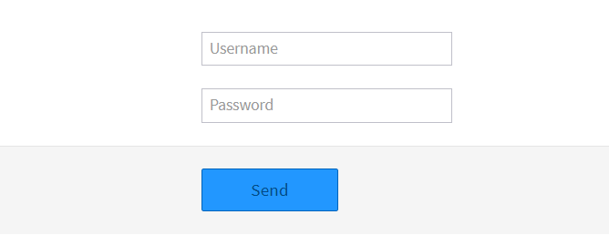

# monster.ui.disableAutoFill()



## Syntax
```javascript
monster.ui.disableAutoFill($target[, options]);
```

### Parameters
Key | Description | Type | Default | Required
:-: | --- | :-: | :-: | :-:
`$target` | Form element containing the fields to temporarily obfuscate. | `jQuery` | | `true`
`options` | Lets you override default options. | `Object`([#/options](#options)) | | `false`

#### `options`
Key | Description | Type | Default | Required
:-: | --- | :-: | :-: | :-:
`validator` | Returns a boolean to determine if `$target` should be submitted (always returns `true` when not specified). | `Function` | | `false`

### Errors

* `"$target" is not a jQuery object`: `$target` is not a jQuery element
* `"options" is not a plain object`: `options` is defined but not a plain object

## Description
The `monster.ui.disableAutoFill()` method obfuscates form fields `name` attributes and transforms `password` inputs into `text` ones to disable browsers/password managers auto filling of `input` elements.

Field `name`s and `password` fields get automatically de-obfuscated right before submission to allow for form validation if necessary.

## Examples

### Get form data on submit
```html
<form class="form-horizontal">
  <div class="control-group">
    <div class="controls">
      <input type="text" name="username" placeholder="Username">
    </div>
  </div>
  <div class="control-group">
    <div class="controls">
      <input type="password" name="password" placeholder="Password">
    </div>
  </div>
  <div class="form-actions">
    <button type="submit" class="monster-button-primary">
      {{i18n.send}}
    </button>
  </div>
</form>
```
```javascript
var $form = $(app.getTemplate({
  name: 'myForm'
}));

monster.ui.disableAutoFill($form, {
  validator: function() {
    return monster.ui.valid($form);
  }
});
monster.ui.validate($form, {
  rules: {
    password: {
      digits: true
    }
  }
});

$form.on('submit', function() {
  var formData = monster.ui.getFormData($form.get(0));

  alert(JSON.stringify(formData, null, 4));
});
```
