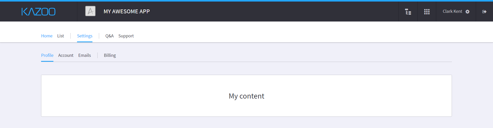
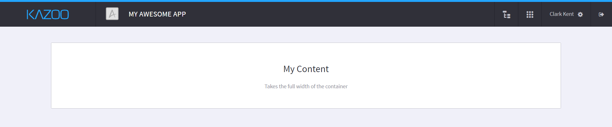
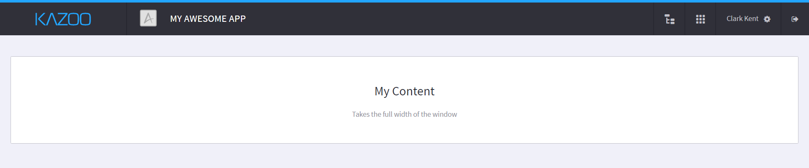
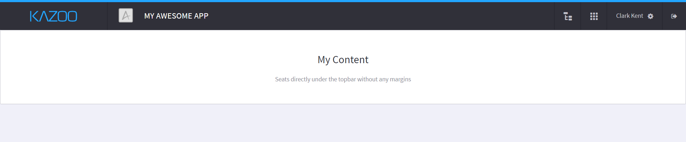
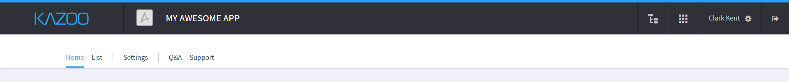
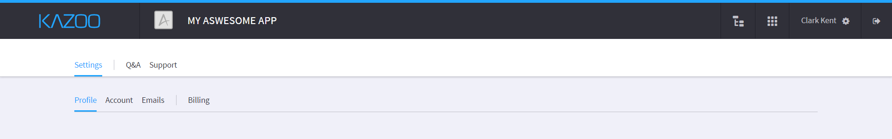
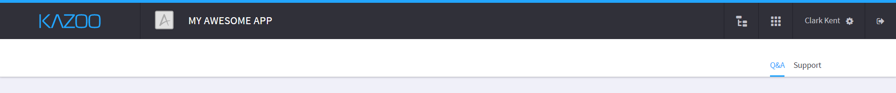
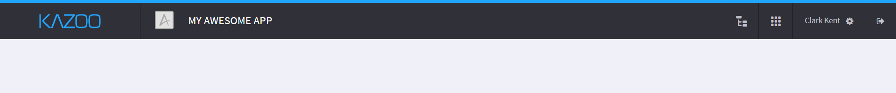

# monster.ui.generateAppLayout()



### Syntax
```javascript
monster.ui.generateAppLayout(thisArg, options);
```

### Parameters
Key | Description | Type | Default | Required
:-: | --- | :-: | :-: | :-:
`thisArg` | Context of the app invoking the helper. | `Object` | | `true`
`options` | | `Object`([#/options](#options)) | | `true`

#### options
Key | Description | Type | Default | Required
:-: | --- | :-: | :-: | :-:
`appType` | Define wrapper behavior. | `String('default' | 'fullscreen' | 'docked')` | `default` | `false`
`forceNavbar` | Render navbar even when only one tab exists (overrides `hideNavbar` when `true`). | `Boolean` | `false` | `false`
`hideNavbar` | Hide navbar even when multiple tabs (more than 1) are defined. | `Boolean` | `false` | `false`
`menus` | | `Array` | | `true`
`menus.[]` | | `Object`([#/menu](#menu)) | | `true`

#### menu
Key | Description | Type | Default | Required
:-: | --- | :-: | :-: | :-:
`pull` | Floating direction. | `String('left' | 'right')` | `left` | `false`
`tabs` | | `Array` | | `true`
`tabs.[]` | | `Object`([#/tab](#tab)) | | `true`

#### tab
Key | Description | Type | Default | Required
:-: | --- | :-: | :-: | :-:
`text` | Tab menu label (mandatory if more than on item in `tabs`). | `String` | | `false`
`callback` | Callback on click (mandatory if no `menus` property). | `Function` | | `false`
`onClick` | Execute before `callback`. | `Function` | | `false`
`layout` | Define layout type for this tab. | `String('fullscreen' | 'docked')` | | `false`
`menus` | | `Array` | | `false`
`menus.[]` | | `Object`([#/menu](#menu)) | | `false`

## Description

The `monster.ui.generateAppLayout()` method generates a consistent markup to wrap the content of your Monster app. It also generates the navbar menu of the app and handles tab clicks and animations. The goal of this method is to empower developers by giving them the basics (app navbar, tabs handling) so they can just an start coding the core of their app.

The markup generated will looks like this:

```html
<div id="{appName}_app_container" class="app-layout">
  <div class="app-header">
    <div class="app-navbar-bg">
      <div class="app-navbar-wrapper">
        <nav class="app-navbar monster-navbar">
          /* app navbar */
        </nav>
      </div>
    </div>
    <div class="app-subnav-bg">
      <div class="app-subnav-wrapper">
        <nav class="app-subnav monster-navbar">
          /* app subnav */
        </nav>
      </div>
    </div>
  </div>
  <div class="app-content-wrapper">
    /* app content */
  </div>
</div>
```

The `monster-navbar` contains the navbar and subnav of the application, depending on the options passed to the method.

## Customization

### appType

An app can have three different types: `default`, `fullscreen` and `docked`. Those types will only impact the markup and styling of the generated layout.

#### `default`
Maximum width of 1280px with 20px of on each sides to keep it from hitting the sides on smaller screens.



#### `fullscreen`
Takes the full width of the window minus the 20px of padding on each side.



#### `docked`
No margin or padding around the wrapper, the content will be right next to the topbar and take full size of the window.



## Examples
### Generate layout with `navbar` and menus



```javascript
monster.ui.generateAppLayout(app, {
  menus: [{
    tabs: [{
      text: 'Home',
      callback: function() {}
    }, {
      text: 'List',
      callback: function() {}
    }]
  }, {
    tabs: [{
      text: 'Settings',
      callback: function() {}
    }]
  }, {
    tabs: [{
      text: 'Q&A',
      callback: function() {}
    }, {
      text: 'Support',
      callback: function() {}
    }]
  }]
});
```

The concept of multiple menus is simply used to group tabs together with a separator between them.

### Generate layout with `navbar` and sub-menus



```javascript
monster.ui.generateAppLayout(app, {
  menus: [{
    tabs: [{
      text: 'Settings',
      menus: [{
        tabs: [{
          text: 'Profile',
          callback: function() {}
        }, {
          text: 'Account',
          callback: function() {}
        }, {
          text: 'Emails',
          callback: function() {}
        }]
      }, {
        tabs: [{
          text: 'Billing',
          callback: function() {}
        }]
      }]
    }]
  }, {
    tabs: [{
      text: 'Q&A',
      callback: function() {}
    }, {
      text: 'Support',
      callback: function() {}
    }]
  }]
});
```

When a menu has sub-menus, the callback of the first sub-menu will be used as its default `callback`.

### Generate layout with `navbar` and menus pulled right



```javascript
monster.ui.generateAppLayout(app, {
  menus: [{
    pull: 'right',
    tabs: [{
      text: 'Q&A',
      callback: function() {}
    }, {
      text: 'Support',
      callback: function() {}
    }]
  }]
});
```

### Generate layout without `navbar`



```javascript
monster.ui.generateAppLayout(app, {
  menus: [{
    tabs: [{
      callback: function() {}
    }]
  }]
});
```

Since only one tab was defined, no `navbar` will be rendered.
