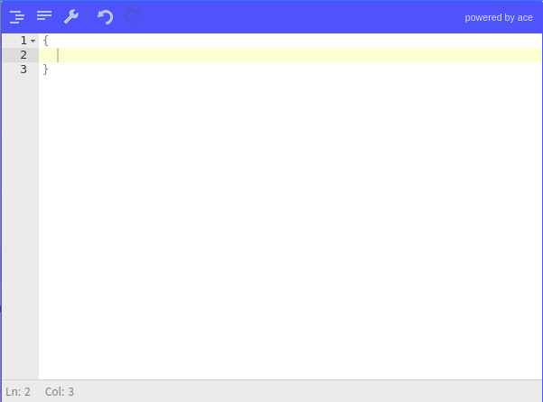

# monster.ui.jsoneditor()
The `monster.ui.jsoneditor()` method generates an instance of a JSON editor with a set of handy methods and properties.



## Syntax
```javascript
monster.ui.jsoneditor(target[,options])
```

### Parameters

Key | Description | Type | Default | Required
:-: | --- | :-: | :-: | :-:
`target` | Container for the JSON Editor widget. | `jQuery` | |`true`
`options` | Let you override default editor options that can be found on the [JSONEditor](https://github.com/josdejong/jsoneditor/blob/master/docs/api.md) page. | `Object`([#options](#options)) | |`false`

### `options`
List of helper specific customizable settings (in opposition to the ones exposed by the JSON Editor library).

Key | Description | Type | Default | Required
:-: | --- | :-: | :-: | :-:
`json` | Default JSON to set in the editor. | `Object` | | `false`

### Return
An instance of the JSONEditor

## Description
The `monster.ui.jsoneditor()` method renders a customizable JSON editor into the specified `target`. This method returns the `JSONEditor` instance so you have access its properties and methods. Please see [JSONEditor](https://github.com/josdejong/jsoneditor) for reference. To get the JSONEditor instance from the DOM please see [getJsoneditor()](./getJsoneditor().md).

To initialize the JSONEditor, you just need to pass the `target` parameter:
```html
<!--You need to set the container's size-->
<div id="jsoneditor" style="width: 400px; height: 400px;"></div>
```

```javascript
var $target = $('#jsoneditor');

var jsoneditor = monster.ui.jsoneditor($target);
```

## Examples
### Use the method options

```javascript
var $target = $('#jsoneditor');
/* To know more about all available options please go to:
 https://github.com/josdejong/jsoneditor/blob/master/docs/api.md */
var options {
  mode: 'review',
  modes: ['code', 'tree'],
  search: true
}
var jsoneditor = monster.ui.jsoneditor($target, options);
```

### Get the final JSON object

```javascript
var $target = $('#jsoneditor');
var jsoneditor = monster.ui.jsoneditor($target);

// This funcion gets the valid JSON object. If the JSON is not valid this method throws an exception.
jsoneditor.get()
```
