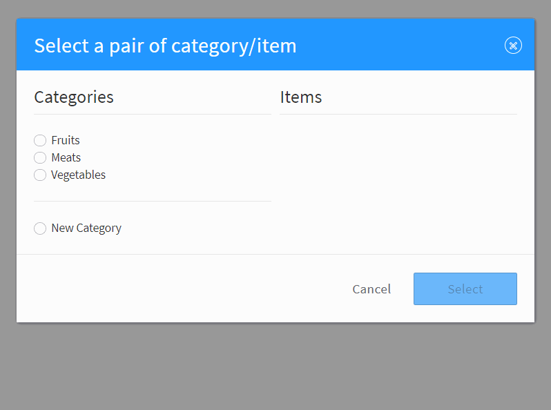

title: keyValueSelector()

# keyValueSelector



## Syntax
```javascript
monster.ui.keyValueSelector(args)
```

### Parameters
`args` is a mandatory `Object` parameter with the following properties:

Key | Description | Type | Default | Required
:-: | --- | :-: | :-: | :-:
`isEditable` | Whether new categories can be added (set to `true` when `choices` is empty/not provided). | `Boolean` | `false` | `false`
`existing` | Map existing categories to existing items (generated form `choices` when not provided).  | `Object` | | `false`
`existing[]` | List of existing items per category. | `Array(String())` | | `true`
`choices` | List of categories/items to render. | `Array`([#/choice](#choice)) | | `false`
`i18n` | Custom internationalization labels. | `Object`([#/i18n](#i18n)) | | `false`
`normalizer` | Used to normalize user input for comparison against existing category/item IDs. | `Function` | `lodash#snakeCase` | `false`
`onSelect` | Callback on select action, invoked with two parameters exposing the category/item selected: (caterogy, item) | `Function` | | `false`

#### `choice`

Key | Description | Type | Default | Required
:-: | --- | :-: | :-: | :-:
`id` | Category identifier. | `String` | | `true`
`label` | Category label. | `String` | | `true`
`isEditable` | Whether new items can be added for this category. | `Boolean` | `false` | `false`
`items` | Category label. | `Array` | | `true`
`items[]` | | `Object` | | `true`
`items[].id` | Item identifier. | `String` | | `true`
`items[].label` | Item label. | `String` | | `true`

#### `i18n`

Key | Description | Type | Default | Required
:-: | --- | :-: | :-: | :-:
`title` | Dialog title label. | `String` | `Select a pair of category/item` | `false`
`categories` | Categories title label | `String` | `Categories` | `false`
`items` | Items title label. | `String` | `Items` | `false`
`newCategory` | New category radio label.  | `String` | `New Category` | `false`
`newItem` | New item radio label. | `String` | `New Item` | `false`
`categoryName` | New category input placeholder. | `String` | `Category Name` | `false`
`itemName` | New item input placeholder. | `String` | `Item Name` | `false`
`cancel` | Cancel button label. | `String` | `Cancel` | `false`
`select` | Select button label. | `String` | `Select` | `false`


## Description

## Example
```js
var existing = {
    fruits: [
        'apple', 'peach', 'pear', 'clementine', 'banana'
    ],
    vegetables: [
        'lettuce', 'aspargus', 'chard', 'spinach', 'broccoli'
    ],
    meats: [
        'veal', 'bison', 'chicken', 'beef', 'pork'
    ]
};

monster.ui.keyValueSelector({
    onSelect: function(key, value) {
        window.alert('category: ' + key + '\nitem: ' + value);
    },
    isEditable: true,
    choices: _
        .chain(existing)
        .keys()
        .map(function(category) {
            return {
                id: category,
                label: _.startCase(category),
                isEditable: true,
                items: _
                    .chain(existing)
                    .get(category)
                    .map(function(item) {
                        return {
                            id: item,
                            label: _.startCase(item)
                        };
                    })
                    .sortBy('label')
                    .value()
            };
        })
        .sortBy('label')
        .value()
});
```
