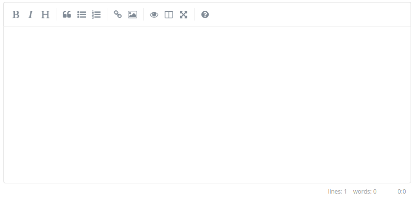

# monster.ui.markdownEditor()
The `monster.ui.markdownEditor()` method converts a simple textarea into a markdown editor.



## Syntax
```javascript
monster.ui.markdownEditor(target[, options]);
```

### Parameters

Key | Description | Type | Default | Required
:-: | --- | :-: | :-: | :-:
`target` | A jQuery object to be converted into a markdown editor. | `jQuery` | | `true`
`options` | List of options used to instantiate a markdown editor (available [options](https://github.com/sparksuite/simplemde-markdown-editor#configuration)). | `Object`([#/options](#options)) | | `false`

## Description
The `monster.ui.markdownEditor()` method converts a simple textarea element into a powerful markdown editor which is specified by the `target` parameter. The toolbar can be customized or hidden completely, please see [markdownEditor docs](https://simplemde.com/) for reference.

To initialize the default markdown editor, the only parameter needed is `target`:
```javascript
var $target = $('#textarea-element');

monster.ui.markdownEditor($target);
```

## Examples
### Hide toolbar
```javascript
var $target = $('#textarea-element');
var overrideOptions = {
  toolbar: false
};

monster.ui.markdownEditor($target, overrideOptions);
```

[markdownEditor]: (https://simplemde.com/)
